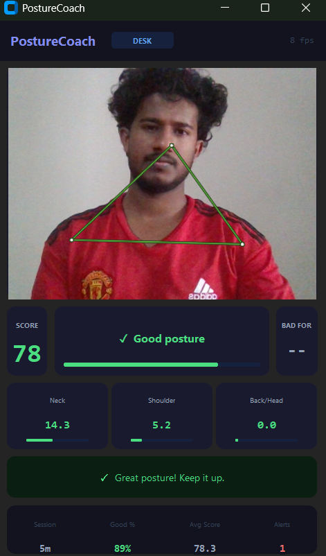

<div align="center">


# PostureCoach

**AI-powered posture monitor that lives on your desktop**

*Watches you work. Speaks up when you slouch. Cheers when you sit tall.*

[](https://github.com/siyad01/postureCoach/actions/workflows/build.yml)
[](LICENSE)
[](https://python.org)
[](https://developers.google.com/mediapipe)
[](#-download)

<br/>


</div>

---

## Why PostureCoach?

Most posture apps require you to wear something, buy hardware, or open a separate app. PostureCoach uses your existing webcam and runs as a **small floating window** that stays on top while you work — like a sticky note that actually does something.

```
Bad posture for 5s  →  Voice says "Your head is too far forward. Please push it back."
                    →  Windows/macOS/Linux notification appears
Good posture 5min   →  Voice says "Great posture. Keep it up."
                    →  Pleasant chime plays
```

No cloud. No subscription. No data leaves your machine.

---

## ⬇️ Download

| Platform | Download | Notes |
|----------|----------|-------|
| **Windows 10/11** | [PostureCoach.exe](../../releases/latest) | Double-click to run |
| **macOS** | [PostureCoach-macOS.zip](../../releases/latest) | Unzip → right-click → Open |
| **Linux** | [PostureCoach-Linux](../../releases/latest) | `chmod +x PostureCoach && ./PostureCoach` |

**No Python required.** Download and run — that's it.

> **macOS note:** First launch may show a security warning. Go to  
> System Settings → Privacy & Security → scroll down → click "Open Anyway"

---

## How it works

```
Webcam frame (30fps)
       │
       ▼
MediaPipe Pose Landmarker     ← 33 body landmarks in real time
       │
       ▼
Posture Analyzer              ← shoulder-width normalized 2D geometry
       │
       ├── Neck angle         (ear horizontal offset from shoulder)
       ├── Shoulder tilt      (Y difference, normalized)
       └── Head height        (nose position vs shoulder line)
       │
       ▼
8-frame smoother              ← eliminates jitter, stable readings
       │
       ├── Bad posture 5s  →  Voice alert + OS notification
       ├── Good posture 5m →  Voice encouragement + chime
       └── Session logger  →  logs/session_YYYYMMDD.json
```

### Two detection modes — automatic switching

| Mode | When | Detects |
|------|------|---------|
| **DESK** | Shoulders visible, hips not | Neck, forward head, shoulder tilt |
| **FULL BODY** | Hips visible | Full spine, neck, shoulders, back curve |

---

## Camera setup

Sit so your **full shoulders are visible** in the camera frame. The camera can be at eye level or slightly below — PostureCoach normalizes all measurements by shoulder width, so distance from the camera doesn't affect accuracy.

```
✅ Good setup          ❌ Too close
┌──────────────┐       ┌──────────────┐
│   [face]     │       │   [FACE]     │
│  /shoulders\ │       │    only      │
│   visible   │       │   face fits  │
└──────────────┘       └──────────────┘
```

---

## Features

- **Real-time detection** — MediaPipe Tasks API, 2026 current, 30fps
- **Shoulder-normalized math** — accurate regardless of camera distance
- **AI voice alerts** — Windows TTS, dedicated thread, ~100ms latency
- **Native notifications** — Windows toast / macOS / Linux notify-send
- **Good posture encouragement** — voice praise every 5 minutes of good posture
- **Floating dark UI** — 380×620, always on top, never blocks your work
- **Session logging** — full JSON history, streaks, scores, alert count
- **Zero cloud** — everything runs locally, no API keys, no internet needed

---

## Screenshot

<div align="center">

</div>

---

## Build from source

```bash
# Clone
git clone https://github.com/siyad01/postureCoach
cd postureCoach

# Virtual environment
python -m venv venv
venv\Scripts\activate          # Windows
source venv/bin/activate       # Mac/Linux

# Install dependencies
pip install -r requirements.txt

# Download pose model (~6MB)
curl -L -o pose_landmarker_full.task \
  "https://storage.googleapis.com/mediapipe-models/pose_landmarker/pose_landmarker_full/float16/latest/pose_landmarker_full.task"

# Run
python app.py
```

### CLI fallback (no GUI required)
```bash
python posturecoach.py
```

---

## Project structure

```
postureCoach/
├── app.py              ← CustomTkinter GUI (main entry point)
├── camera.py           ← Background webcam + MediaPipe thread
├── analyzer.py         ← Posture math (2D pixel geometry)
├── overlay.py          ← Skeleton drawing on video frame
├── notifications.py    ← Voice TTS + OS notifications
├── logger.py           ← Session recording (JSON)
├── config.py           ← All settings (thresholds, timing)
├── posturecoach.py     ← CLI fallback (OpenCV window)
└── .github/workflows/
    └── build.yml       ← Auto-builds for Win/Mac/Linux
```

---

## Session data

Every session saved to `logs/session_YYYYMMDD_HHMMSS.json`:

```json
{
  "session_id": "20260505_090000",
  "summary": {
    "date": "2026-05-05",
    "duration_minutes": 47.3,
    "good_posture_percent": 81.2,
    "average_score": 86,
    "total_alerts": 2,
    "longest_good_streak": 923.0,
    "longest_bad_streak": 38.0
  }
}
```

---

## Configuration

All settings in `config.py`:

```python
alert_delay_seconds:     int   = 5    # seconds before alert fires
alert_repeat_seconds:    int   = 120  # min gap between alerts
neck_angle_threshold:    float = 18.0 # sensitivity (lower = stricter)
shoulder_tilt_threshold: float = 18.0
back_angle_threshold:    float = 8.0
```

---

## Tech stack

| Library | Version | Purpose |
|---------|---------|---------|
| MediaPipe | Latest | Pose landmark detection |
| OpenCV | 4.x | Webcam capture |
| CustomTkinter | 5.x | Modern dark UI |
| pyttsx3 | 2.x | Local TTS voice |
| win11toast | Latest | Windows notifications |
| NumPy | 1.x | Angle math |
| Pydantic | 2.x | Config validation |
| PyInstaller | 6.x | Packaging |

---

## Roadmap

- [ ] Calibration mode — learn YOUR good posture baseline
- [ ] Break reminders — stand up every hour
- [ ] Weekly report — posture trends over time
- [ ] Hotkey to pause/resume monitoring
- [ ] Multiple camera support
- [ ] Custom voice messages

---

## Contributing

Issues and PRs welcome. If you know Python, you can contribute.

```bash
git checkout -b feature/your-feature
# make changes, test with: python app.py
git push origin feature/your-feature
# open a Pull Request
```

**Good first issues:** custom voice messages, break reminders, calibration mode.

---

## License

MIT — free to use, modify, and distribute.

---

<div align="center">

Built with MediaPipe · OpenCV · CustomTkinter

**100% local · No cloud · No data collection · No subscription**

*If this helps your posture, give it a ⭐*

</div>